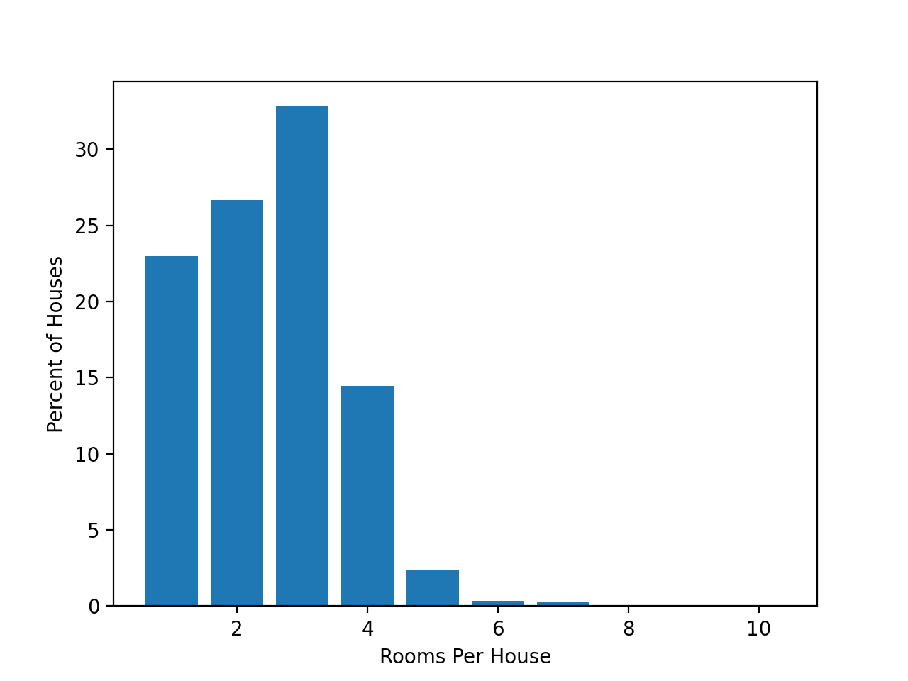
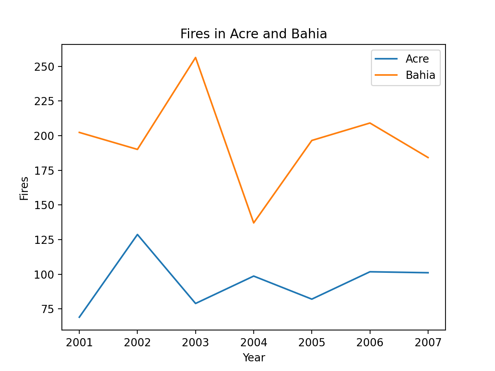

# Visualization of Some Data About Brazil

## Houses for Rent in Sao Paulo

The data set I used chose 6079 houses in Sao Paulo that were listed for rent. I was interested in ordering them by what percentage of the total had a certain number of rooms, from 1 to 10. There were only 2 houses in the data set with 10 rooms listed. 

[Here's](https://www.kaggle.com/rubenssjr/brasilian-houses-to-rent) the houses for rent data, which I found on Kaggle.

## Number of Fires in Acre and Bahia by year

This data listed the number of wildfires reported in each state of Brazil from the late 90s to 2017, but I indexed 2001 to 2007, and only focused on Acre and Bahia. Fires in Brazil are a particularly important issue as the Amazon is home to the largest rainforest in the world.

[Here's](https://www.kaggle.com/gustavomodelli/forest-fires-in-brazil) the fire data, which I also found on Kaggle. 

[This](https://github.com/mikeizbicki/cmc-csci040/tree/2021fall/hw_02) is the link for the GitHub instructions. 